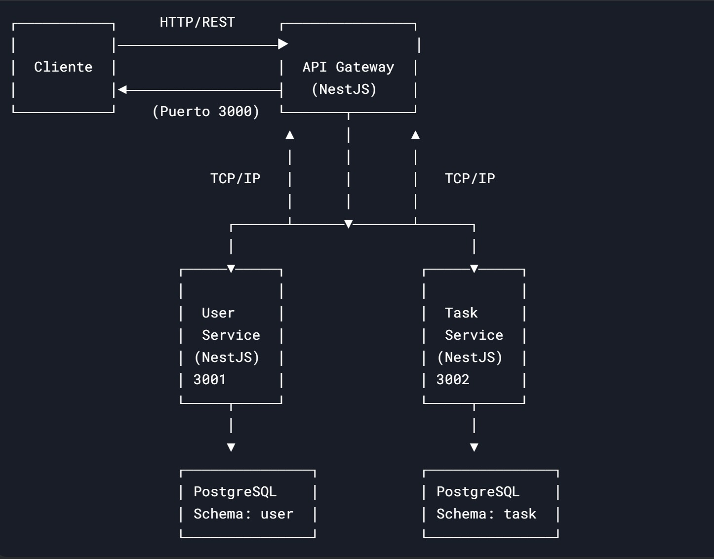

# API Gateway + Microservicios (User & Task)

Este proyecto consiste en un **API Gateway** que gestiona dos microservicios:
- **User Service**: Maneja autenticación (`auth`) y perfiles de usuario (`user`).
- **Task Service**: Gestiona tareas con operaciones CRUD.



## 🚀 Tecnologías
- **NestJS** (API Gateway y microservicios)
- **Docker** + **Docker Compose** (Contenedorización)
- **PostgreSQL** (Base de datos)
- **Prisma** (ORM)
- **Swagger** (Documentación API)
- **JWT** (Autenticación)

---

## 📋 Requisitos
- Docker ([Instalación](https://docs.docker.com/get-docker/))
- Docker Compose
- Node.js v18+
- npm o yarn

---

## 🔧 Configuración

### 1. Variables de entorno
Crea un archivo `.env` en la raíz del proyecto basado en `.env.example`:
```bash
cp .env.example .env 
```
Edita el .env con tus valores:

## PostgreSQL
    POSTGRES_USER=tu_usuario
    POSTGRES_PASSWORD=tu_contraseña
    POSTGRES_DB=task_manager
    DATABASE_URL_USER=bd_url
    DATABASE_URL_TASK=bd_url

## JWT

JWT_SECRET=tu_secreto_jwt

## 🛠 Instalación
1. Clonar el repositorio:

   ```bash
   git clone [https://github.com/GabAntoLocia/task-manager-services.git]
    ```

 2. Instalar dependencias:
     ```bash 
    npm install
    #o
    yarn install
    ```


   ▶️ Opción 1: Comando Directo
        
```bash
    pm2 start app.js --name "mi-app" --watch
``` 
    
*(Reemplaza app.js por tu archivo de entrada principal ej. apps/task-manager-service/main.ts)*


▶️ Opción 2: Usando ecosystem.config.js (Recomendado)
    
1. Crear archivo de configuración (si no existe):

```bash
    pm2 init simple

```

Editar el archivo generado (ecosystem.config.js):

    module.exports = 
    {
      apps: [
        {
          name: "api-gateway",
          script: "./dist/apps/task-manager-services/main.js", // Ruta relativa desde la raíz
          cwd: "./", // Directorio de trabajo
          watch: ["apps/api-gateway"],
          env: {
            NODE_ENV: "development"
          }
        },
        {
          name: "user-service",
          script: "./dist/apps/user-service/main.js",
          watch: ["apps/user-service"]
        },
        {
          name: "task-service",
          script: "./dist/apps/task-service/main.js",
          watch: ["apps/task-service"]
        }
          ]
      };

 2. Iniciar:
```bash
    pm2 start ecosystem.config.js
```

🔄 Comandos Útiles de PM2


| Comando | Descripción |
|---------|-------------|
| `pm2 list` | Listar procesos activos |
| `pm2 logs` | Mostrar logs en tiempo real |
| `pm2 restart mi-app` | Reiniciar la aplicación |
| `pm2 stop mi-app` | Detener la aplicación |
| `pm2 delete mi-app` | Eliminar la aplicación de PM2 |
| `pm2 save` | Guardar procesos para inicio automático |
| `pm2 startup` | Configurar inicio con el sistema |
| `pm2 monit` | Interfaz de monitoreo local |
| `pm2 plus` | Acceder al dashboard en la nube (PM2 Plus) |

## Monitoreo

- **Interfaz local**:  
  
  ```bash
    pm2 monit
  
* **Dashboard en la nube (PM2 Plus)**:

    ```bash
      pm2 plus
    ```
## Acceder a la documentación 📄
La interfaz **Swagger UI** estará disponible en:

```bash
    http://localhost:3000/api-docs
```
## 3. Endpoints documentados

  Verás estas secciones organizadas:

- Auth: Endpoints de autenticación

    - /auth/register (POST)

    - /auth/login (POST)

    - /auth/logout (POST)

- Users:

    - /users/profile (GET)

- Tasks:

    - /task/create (POST)

    - /task/getAll (GET)

    - /task/update/{id} (PUT)

    - /task/delete/{id} (DELETE)


## 4. Probar endpoints directamente
  En Swagger UI puedes:

- Hacer clic en cualquier endpoint

- Seleccionar "Try it out"

- Introducir datos de prueba

- Ejecutar con "Execute"
```
## 🧪 Colección de Postman

```
Puedes descargar y usar la colección de Postman para probar los endpoints de la API:

👉 [Descargar colección Postman](./postman/mi-coleccion.postman_collection.json)


<p align="center">
  <a href="http://nestjs.com/" target="blank"></a>
</p>

[circleci-image]: https://img.shields.io/circleci/build/github/nestjs/nest/master?token=abc123def456
[circleci-url]: https://circleci.com/gh/nestjs/nest

  <p align="center">A progressive <a href="http://nodejs.org" target="_blank">Node.js</a> framework for building efficient and scalable server-side applications.</p>
    <p align="center">
<a href="https://www.npmjs.com/~nestjscore" target="_blank"></a>
<a href="https://www.npmjs.com/~nestjscore" target="_blank"></a>
<a href="https://www.npmjs.com/~nestjscore" target="_blank"></a>
<a href="https://circleci.com/gh/nestjs/nest" target="_blank"></a>
<a href="https://coveralls.io/github/nestjs/nest?branch=master" target="_blank"></a>
<a href="https://discord.gg/G7Qnnhy" target="_blank"></a>
<a href="https://opencollective.com/nest#backer" target="_blank"></a>
<a href="https://opencollective.com/nest#sponsor" target="_blank"></a>
  <a href="https://paypal.me/kamilmysliwiec" target="_blank"></a>
    <a href="https://opencollective.com/nest#sponsor"  target="_blank"></a>
  <a href="https://twitter.com/nestframework" target="_blank"></a>
</p>
  <!--[](https://opencollective.com/nest#backer)
  [](https://opencollective.com/nest#sponsor)-->

